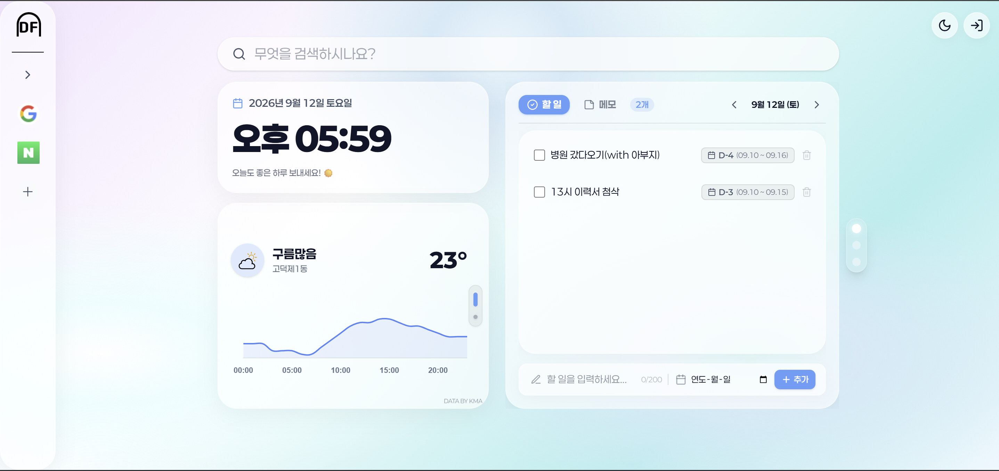

# DoorFrame

## 프로젝트 개요

나만의 시작 페이지 - 한 곳에서 관리하는 북마크, 메모, 할 일

> ⚠️ 이 프로젝트는 개인 포트폴리오 용이며, 외부 기여나 배포는 허용되지 않습니다.



## 기술 스택

### Core

- React 18 + TypeScript
- Vite

### State & Data

- Redux Toolkit
- Chrome Storage API
- Supabase (Authentication & Edge Functions)
- Google Gemini API (AI News Summarization)

### UI & Styling

- Tailwind CSS v4
- Lucide React (Icons)
- @dnd-kit (Drag & Drop)
- Typewriter-effect (Loading UI)

## 주요기능

### AI 뉴스 브리핑 (New!)

- 구글 및 네이버 뉴스를 기반으로 한 최신 뉴스 요약 서비스
- 카테고리별 뉴스 필터링 및 사용자 정의 키워드 검색 지원
- **Google Gemini API**를 활용한 핵심 키워드 추출 및 트렌드 분석 요약
- 반응형 레이아웃 (데스크탑/태블릿/모바일 최적화)

### 실시간 코인 시세

- 업비트(Upbit) API를 활용한 실시간 코인 가격 조회
- KRW 기준 실시간 변동률(%) 및 변동액(원) 시각화
- 반응형 레이아웃 지원

### 단기/초단기 날씨 예보 (Updated!)

- **기상청(KMA) 단기예보 Open API 기반** 실시간 예보 파이프라인 통합 (향후 24시간 및 3일 예보)
- Chart.js를 이용한 24시간 기온 추이 시각화
- 마우스 휠 스크롤 인터랙티브 캐러셀 (현재 실황 vs 단기 예보 요약)
- 마우스 트래킹 기반 스마트 툴팁 시스템 탑재
- 기온 색상 메타포(고온/저온/강수) 적용으로 직관성 향상

### 북마크

- 자주 방문하는 사이트 북마크
- 사이드 바로 구현해 접근성 향상
- 드래그 앤 드롭으로 순서 변경
- 로그인 상태에 따라 ChromeStorage에 저장

### 메모 & 할 일

- 간단한 메모 작성
- 체크박스를 활용한 할 일 관리
- 로그인 상태에 따라 ChromeStorage에 저장

## 개발 및 로컬 실행 방법

### 개발 환경 설정

1. **저장소 클론**

```bash
git clone https://github.com/yourusername/doorframe.git
cd doorframe
```

2. **의존성 설치**

```bash
npm install
```

3. **환경 변수 설정**

프로젝트 루트에 `.env` 파일 생성 (클라이언트 번들에는 공개용 Supabase 키만 주입됩니다):

```env
VITE_SUPABASE_URL=https://your_project.supabase.co
VITE_SUPABASE_ANON_KEY=your_supabase_anon_key
```

> 💡 **보안 안내**: 기상청, VWorld, Gemini 등 외부 API 키는 클라이언트 번들에 노출되지 않도록 **Supabase Edge Functions Secrets**에서 안전하게 관리됩니다.

4. **개발 서버 실행**

```bash
npm run dev
```

### Chrome Extension 빌드

> 본 확장 프로그램은 Chrome Web Store에 등록되지 않았기 때문에 아래와 같은 방식으로 로컬에서 직접 로드해야 합니다.

1. **프로덕션 빌드**

```bash
npm run build
```

2. **Chrome Extension 로드**
   - Chrome에서 `chrome://extensions/` 접속
   - 우측 상단 "개발자 모드" 활성화
   - "압축해제된 확장 프로그램을 로드합니다" 클릭
   - `dist/` 폴더 선택

## 🔧 아키텍처 및 외부 API 연동 가이드

### 🛡️ 보안 프록시 아키텍처 (Secure Edge Proxy Architecture)

Chrome 확장 프로그램 특성상 클라이언트 코드(`dist/`)에 민감한 API 키가 포함되면 누구나 개발자 도구를 통해 키를 탈취할 수 있습니다. 이를 근본적으로 방지하기 위해 **Supabase Edge Functions**를 보안 프록시 계층으로 구축했습니다:

1. **클라이언트 (Frontend)**:
   * 오직 공개 가능한 **Supabase Project URL**과 **Anon Public Key**만 `.env`에 포함합니다.
   * `anon` 키는 RLS(행 단위 보안) 및 Auth 정책으로 안전하게 보호됩니다.
2. **서버리스 백엔드 (Supabase Edge Functions)**:
   * 비용 및 호출 할당량이 연결된 민감한 외부 API 키들을 **Supabase Secrets**에만 안전하게 격리 보관합니다.
   * 클라이언트 요청을 받아 외부 API를 대리 호출(Proxy)하고, 응답 데이터를 정제/가공하여 클라이언트에 반환합니다.

---

### 🔑 외부 API 발급처 및 연동 내역

| 서비스/기능 | 외부 API 발급처 | 사용 목적 및 연동 엔드포인트 | 저장 위치 |
| :--- | :--- | :--- | :--- |
| **인증 & 백엔드 연동** | [Supabase](https://supabase.com/dashboard) | Google OAuth 로그인, 파비콘 Storage 업로드, 엣지 함수 호출 | 클라이언트 [`.env`](file:///C:/Users/pit19/OneDrive/바탕%20화면/프로그래밍/doorframe/.env)<br>(`VITE_SUPABASE_URL`, `VITE_SUPABASE_ANON_KEY`) |
| **단기/초단기 날씨 예보**<br>(1순위 주 엔진) | [공공데이터포털](https://www.data.go.kr/)<br>(`기상청_단기예보 조회서비스`) | - `getUltraSrtNcst`: 현재 시각 실시간 기온/강수 실황<br>- `getVilageFcst`: 24시간 시간별 기온 및 3일 예보 데이터 | Supabase Secrets<br>(`VITE_PUBLIC_WEATHER_API_KEY`) |
| **위치 역지오코딩**<br>(1순위 주 엔진) | [VWorld 국가공간정보포털](https://www.vworld.kr/)<br>(`오픈API 지오코더`) | GPS 위경도(`lat`, `lon`, `EPSG:4326`) 좌표를 '서울특별시 중구 명동' 등 사용자 친화적 행정동 명칭으로 변환 | Supabase Secrets<br>(`VITE_PUBLIC_GEOCODER_API_KEY`) |
| **무료 기상/지오코딩 백업**<br>(2순위 장애 대비 엔진) | [Open-Meteo](https://open-meteo.com/)<br>& [BigDataCloud](https://www.bigdatacloud.com/) | 공공데이터포털/VWorld 서버 점검, 일일 할당량 초과, 키 만료 시 실시간 기온/24시간 차트 및 한글 주소를 무중단 대리 공급 | Supabase Edge Function 내부<br>(별도 키 발급 불필요, 무제한 오픈 API) |
| **AI 뉴스 요약 및 키워드** | [Google AI Studio](https://aistudio.google.com/)<br>(`Gemini API`) | 최신 구글/네이버 뉴스 피드를 분석하여 카테고리별 핵심 키워드 추출 및 트렌드 3줄 요약 | Supabase Secrets<br>(`GEMINI_API_KEY`) |

## 📁 프로젝트 구조

```
doorframe/
├── public/
│   ├── manifest.json       # Chrome Extension 설정
│   └── icons/              # 아이콘 리소스
├── src/
│   ├── components/         # React 컴포넌트
│   │   ├── container/
│   │   │   └── subcomponents/
│   │   │       └── mainSec/
│   │   │           └── newsBrief/ # 뉴스 브리핑 UI 컴포넌트
│   │   ├── favBar/
│   │   └── modal/
│   ├── hooks/             # 커스텀 훅 (비즈니스 로직 분리)
│   ├── store/             # Redux 스토어
│   ├── type/              # 전역 타입 정의
│   ├── util/              # 유틸리티 함수
│   ├── config/            # 설정 파일
│   ├── App.tsx
│   └── styles/
│       └── global.css      # 전역 스타일 및 테마
├── supabase/
│   └── functions/          # Edge Functions (News Summarizer, Weather Proxy)
├── .env                   # 환경 변수
├── vite.config.ts
└── package.json
```

## 🎨 커스터마이징

### 색상 및 폰트 테마

`src/styles/global.css`에서 테마 수정:

- **Font**: `Paperlogy` (기본 폰트)
- **Colors**: `main`, `background`, `point`, `important`, `title`, `context`

---

### Supabase Edge Function 설정 및 배포

1. [Supabase CLI](https://supabase.com/docs/guides/cli) 로그인 및 프로젝트 연결:
   ```bash
   npx supabase login
   npx supabase link --project-ref <your-project-ref>
   ```
2. 외부 API 키 Secrets 등록:
   ```bash
   npx supabase secrets set VITE_PUBLIC_WEATHER_API_KEY="your_weather_key"
   npx supabase secrets set VITE_PUBLIC_GEOCODER_API_KEY="your_vworld_key"
   npx supabase secrets set GEMINI_API_KEY="your_gemini_key"
   ```
3. Edge Functions 배포:
   ```bash
   npx supabase functions deploy weather
   npx supabase functions deploy news-briefing
   npx supabase functions deploy favicon-proxy
   ```

## 🐛 트러블슈팅

### Rate Limit 에러

기상청 API 및 Gemini API는 호출 제한이 있을 수 있습니다. 캐싱이 적용되어 있으나, 반복적인 요청 시 잠시 기다려주세요.

### 로그인 안 됨

- Supabase 프로젝트에서 Google Provider가 활성화되어 있는지 확인
- Google OAuth 리디렉션 URI 설정 확인
- `.env` 파일의 Supabase 키 확인

### 위치 권한 오류

브라우저에서 위치 권한을 허용해주세요.

## 🔮 향후 계획

- Chrome Web Store 등록 검토
- 사용자 설정 동기화 기능 추가
- 테마 커스터마이징 고도화
- 야간 모드

## 🚀 릴리스 노트

### v1.3.01 (2026-09-09)
- **확장 프로그램 프로덕션 배포 완료**:
  - 원격 Supabase Cloud 연동 및 최신 프로덕션 번들 빌드(`npm run build`) 완료 (`dist/` 생성)
  - Chrome 확장 프로그램(`chrome://extensions`) 로컬 배포 파이프라인 검증
- **보안 프록시 아키텍처 확립**:
  - 클라이언트 번들 내 민감 키(기상청, VWorld, Gemini) 노출 방지를 위해 Supabase Edge Functions Secrets로 완벽 격리
  - 프론트엔드는 RLS 및 Auth 정책으로 보호되는 Supabase 공개(`anon`) 키만 사용하는 안전한 아키텍처 구축
- **캐러셀 슬라이드 컴팩트화**:
  - 미완성/과도한 권한의 유튜브 슬라이드를 제외하고 핵심 3종 슬라이드(캘린더/메모, AI 뉴스, 실시간 코인 시세)로 최적화
- **단위 테스트 스위트 전수 정상화**:
  - JSDOM 환경용 `localStorage` 모킹 추가 및 최신 Redux 구조 기반 테스트 전수 갱신 (17개 파일 37개 테스트 100% 통과)

### v1.3.0 (2026-05-25)
- **UI/UX 폴리싱 및 레이아웃 최적화**:
  - 내비게이션 Popover 너비 제어 일관성 확보 및 테마별 아이콘 가시성 개선
  - 메모/할 일 팝업 정보 계층화, 입력 피드백 강화 및 글래스모피즘 테마 통일
  - 캘린더 슬라이드 연동 및 날짜 기반 메모/할 일 관리 시스템 구축
  - 하단 캐러셀 슬라이드 표준화 (캘린더 연동, AI 뉴스, 실시간 코인 시세 3종 중심 재편)
- **보안 및 테스트 스위트 강화**:
  - 클라이언트 번들 내 민감 키 제거 및 Supabase Edge Functions Secrets로 환경 격리
  - Vitest 단위 테스트 스위트 전수 최신화 및 100% 정상 통과 보장 (17개 파일 37개 테스트)

### v1.2.0.1 (2026-05-03)
- **확장 프로그램 아키텍처 재구조화**:
  - Manifest V3 기반 안정적 빌드 환경 및 서비스 워커 연동
  - 팝업 전용 엔트리 포인트 구성 및 Chrome Storage 기반 상태 영속성(Persistence) 확보
  - 최소 권한 원칙(Principle of Least Privilege) 준수를 위한 보안 권한(identity 등) 최적화
  - 확장 프로그램용 멀티 엔트리 빌드 파이프라인 정비 (Vite)

### v1.2.0 (2026-04-26)
- **날씨 시스템 고도화**:
  - 기상청 데이터 엔진 연동 및 실시간 예보 파이프라인 구축
  - Chart.js 기반 24시간 기온 추이 시각화
  - 인터랙티브 듀얼 모드 캐러셀(스크롤 전환) 및 스마트 툴팁 탑재
  - Flex 레이아웃 리팩토링 및 UX 폴리싱

### v1.1.2 (2026-04-12)
- **웹 접근성(a11y) 최적화**: 
  - 시맨틱 마크업(header, nav, main, article, footer) 재구조화
  - ARIA 속성(aria-live, aria-busy, aria-label) 전수 적용
  - 전역 :focus-visible 스타일 도입 및 키보드 네비게이션 고도화
  - 이미지 alt 및 WCAG 색상 대비 표준 준수 보강

### v1.1.1 (2026-04-12)
- **성능 최적화**: Lighthouse 지표 대폭 개선 (FCP 0.5s, LCP 0.6s 달성)
  - `manualChunks` 전략으로 번들 크기 최적화 및 코드 스플리팅 적용
  - 핵심 리소스 `modulepreload` 및 `fetchpriority="high"` 적용
- **에셋 및 리소스**: 
  - 빌드 파이프라인 정립 및 CSS/아이콘 렌더링 최적화
  - CLS(레이아웃 변경) 방지를 위한 레이아웃 및 이미지 사이즈 명시적 지정

## 개발자

박인태
