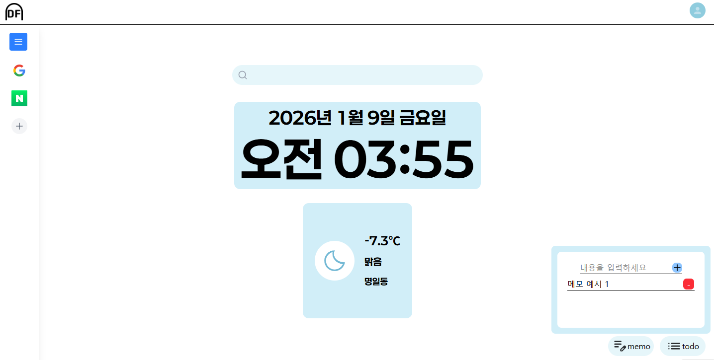

# DoorFrame

## 프로젝트 개요

나만의 시작 페이지 - 한 곳에서 관리하는 북마크, 메모, 할 일

> ⚠️ 이 프로젝트는 개인 포트폴리오용이며, 외부 기여나 배포는 허용되지 않습니다.



## 기술 스택

### Core

- React 18 + TypeScript
- Vite

### State & Data

- Redux Toolkit
- Chrome Storage API
- Supabase (Authentication)

### UI & Styling

- Tailwind CSS v4
- Lucide React (Icons)
- @dnd-kit (Drag & Drop)

## 주요기능

### 실시간 날씨

- 현재 위치 기반 날씨 제공 (기상청 날씨 API + 국토교통부 Geocoder API)
- 온도, 날씨상태, 지역 표시
- 클라이언트 캐싱 방식

### 북마크

- 자주 방문하는 사이트 북마크
- 사이드 바로 구현해 접근성 향상
- 드래그 앤 드롭으로 순서 변경
- 로그인 상태에 따라 ChromeStorage에 저장

### 메모 & 할 일

- 간단한 메모 작성
- 체크박스를 활용한 할 일 관리
- 로그인 상태에 따라 ChromeStorage에 저장

## 개발 및 로컬 실행 방법

### 개발 환경 설정

1. **저장소 클론**

```bash
git clone https://github.com/yourusername/doorframe.git
cd doorframe
```

2. **의존성 설치**

```bash
npm install
```

3. **환경 변수 설정**

`.env` 파일 생성:

```env
VITE_SUPABASE_URL=your_supabase_url
VITE_SUPABASE_ANON_KEY=your_supabase_anon_key
VITE_WEATHER_API_KEY=your_weather_api_key
VITE_GEOCODER_API_KEY=your_geocoder_api_key
```

4. **개발 서버 실행**

```bash
npm run dev
```

### Chrome Extension 빌드

> 본 확장 프로그램은 Chrome Web Store에 등록되지 않았기 때문에 아래와 같은 방식으로 로컬에서 직접 로드해야 합니다.

1. **프로덕션 빌드**

```bash
npm run build
```

2. **Chrome Extension 로드**
   - Chrome에서 `chrome://extensions/` 접속
   - 우측 상단 "개발자 모드" 활성화
   - "압축해제된 확장 프로그램을 로드합니다" 클릭
   - `dist/` 폴더 선택

## 🔧 설정 가이드

### Supabase 설정

1. [Supabase](https://supabase.com) 프로젝트 생성
2. Authentication > Providers > Google 활성화
3. Google OAuth Client ID/Secret 입력
4. Project URL과 anon key를 `.env`에 추가

### 기상청 API 키 발급

1. [공공데이터포털](https://www.data.go.kr/) 회원가입
2. "기상청\_단기예보 조회서비스" 신청
3. 발급받은 서비스키를 `.env`에 추가

### VWorld API 키 발급

1. [VWorld](https://www.vworld.kr/) 회원가입
2. 오픈API 신청
3. 발급받은 키를 `.env`에 추가

## 📁 프로젝트 구조

```
doorframe/
├── public/
│   ├── manifest.json       # Chrome Extension 설정
│   ├── icon-16.png
│   ├── icon-48.png
│   └── icon-128.png
├── src/
│   ├── components/         # React 컴포넌트
│   │   ├── container/
│   │   ├── favBar/
│   │   └── modal/
│   ├── store/             # Redux 스토어
│   │   └── slice/
│   ├── thunk/             # 비동기 액션
│   ├── util/              # 유틸리티 함수
│   ├── config/            # 설정 파일
│   │   └── supabase.ts
│   ├── App.tsx
│   ├── main.tsx
│   └── styles/
│       └── globals.css
├── .env                   # 환경 변수
├── vite.config.ts
├── tailwind.config.ts
└── package.json
```

## 🎨 커스터마이징

### 색상 테마 변경

`src/styles/globals.css`에서 CSS 변수 수정:

```css
:root {
  --color-main: 230 246 250;
  --color-background: 209 238 248;
  --color-point: 79 163 199;
  --color-important: 248 155 0;
}
```

### 기본 북마크 변경

`src/thunk/bookmarkThunk.ts`에서 `defaultBookmarks` 수정

## 🐛 트러블슈팅

### Rate Limit 에러

기상청 API는 시간당 호출 제한이 있습니다. 10분 캐싱이 적용되어 있으니 잠시 기다려주세요.

### 로그인 안 됨

- Supabase 프로젝트에서 Google Provider가 활성화되어 있는지 확인
- Google OAuth 리디렉션 URI 설정 확인
- `.env` 파일의 Supabase 키 확인

### 위치 권한 오류

브라우저에서 위치 권한을 허용해주세요.

## 🔮 향후 계획

- Chrome Web Store 등록 검토
- 사용자 설정 동기화 기능 추가
- 테마 커스터마이징 고도화

## 개발자

박인태
